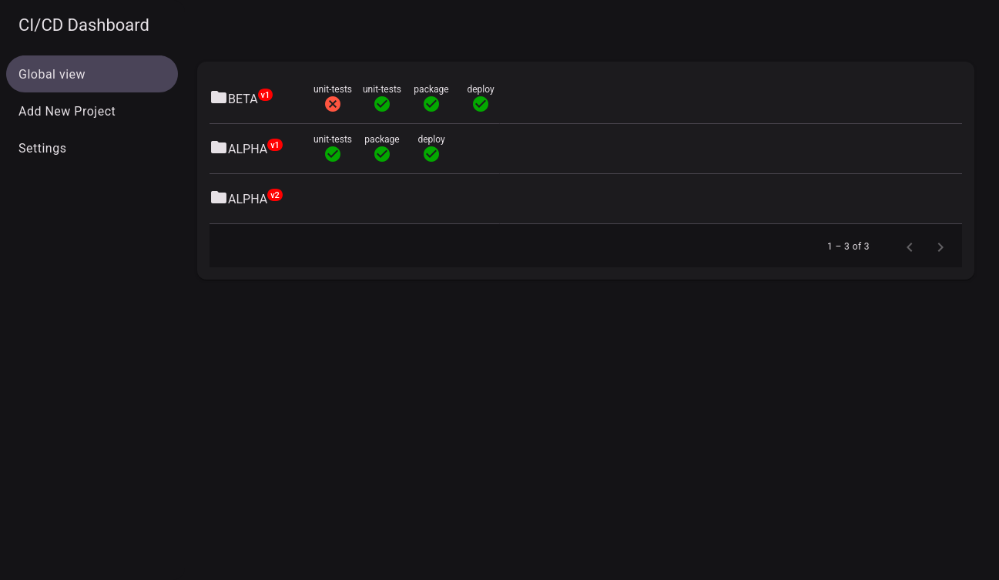
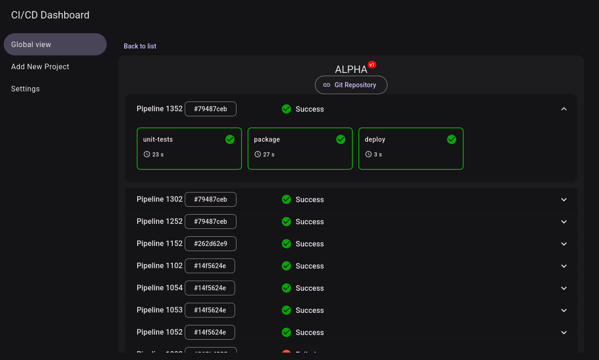

# CI/CD Dashboard (WIP)

## 📋 Description

Modern web dashboard built with Angular 21, designed to monitor and manage Continuous Integration and Continuous Deployment (CI/CD) pipelines. It offers real-time insights into build statuses, deployment progress, and other critical metrics to help development teams streamline their workflows.

This is the frontend of a larger system designed to enhance the CI/CD experience. To make it fully functional, it needs to be integrated with a backend service that collects and processes CI/CD data. The backend API is under development and available **[here](https://github.com/iandeveseleer/cicd-dashboard-api)**





## 🚀 Features

- **Real-time Pipeline Monitoring**: Automatic refresh every 15 seconds to track pipeline progress
- **Global View Dashboard**: Overview of all projects, versions, and their CI/CD status
- **Detailed Project View**: In-depth information about specific pipelines and jobs
- **Visual Status Indicators**: Color-coded status representation for quick assessment
- **Job Details Tooltips**: Hover to see execution duration, test results, and code quality metrics
- **Pagination Support**: Efficient navigation through large project lists
- **Responsive Design**: Built with Angular Material for a modern, adaptive interface
- **GitLab Integration**: Designed to work with GitLab CI/CD (other tools coming soon)
- **Theme Support**: Light and dark theme switching capabilities

## 🏗️ Architecture

### Component Structure

- **GlobalViewComponent**: Main dashboard displaying all projects with pagination
- **ProjectDetailComponent**: Detailed view of a specific project's pipelines and jobs
- **LayoutComponent**: Application layout wrapper with navigation
- **SettingsComponent**: Configuration and preferences management

### Core Services

- **ApiService**: HTTP client for backend REST API communication
- **ThemingService**: Theme management and status styling utilities

### Data Model

- **Project**: Project information with repository details
- **ProjectVersion**: Specific versions of a project (branches, tags)
- **Pipeline**: CI/CD pipelines with their status and execution data
- **Job**: Individual pipeline jobs with details, test results, and code quality metrics

## 🛠️ Technologies

- **Angular 21.0.0**: Modern web framework
- **Angular Material 21.0.2**: UI component library
- **RxJS 7.8.0**: Reactive programming library
- **TypeScript 5.9.2**: Type-safe JavaScript
- **Vitest 4.0.8**: Fast unit testing framework
- **SCSS**: Styling with CSS preprocessor

## 📦 Prerequisites

- **Node.js**: Version 18 or higher
- **npm**: Version 9 or higher (comes with Node.js)
- **Angular CLI**: Version 21.0.2
- **Backend API**: Running instance of cicd-dashboard-api

## 🔧 Installation and Configuration

### 1. Clone the project

```bash
git clone <repository-url>
cd cicd-dashboard
```

### 2. Install dependencies

```bash
npm install
```

### 3. Configure the API proxy

The `proxy.conf.json` file contains the API proxy configuration:

```json
{
  "/api": {
    "target": "http://localhost:8080",
    "secure": false,
    "changeOrigin": true
  }
}
```

Update the `target` URL to point to your backend API instance.

### 4. Start the development server

```bash
npm start
# or
ng serve
```

The application will be accessible at `http://localhost:4200/` and will automatically reload when you modify source files.

## 🏗️ Building

### Development Build

```bash
ng build
```

### Production Build

```bash
ng build --configuration production
```

Build artifacts will be stored in the `dist/` directory, optimized for performance and speed.

## 🧪 Testing

### Unit Tests

Run unit tests with Vitest:

```bash
npm test
# or
ng test
```

### Test Coverage

Generate coverage report:

```bash
ng test --coverage
```

## 📊 Available Routes

- `/`: Global dashboard view with all projects
- `/projects/:projectId/version/:versionId`: Detailed project version view
- `/projects/:projectId/version/:versionId/job/:jobId`: Specific job details
- `/settings`: Application settings and preferences

## 🎨 Theming

The application supports custom theming using Angular Material. Theme files are located in:

- `src/theme.scss`: Main theme configuration
- `src/app/core/layout/_layout-component.theme.scss`: Layout component theme
- `src/app/global-view/_global-view.theme.scss`: Global view theme
- `src/app/project-detail/_project-detail.theme.scss`: Project detail theme

## 🔧 Development Tools

### Code Scaffolding

Generate new components:

```bash
ng generate component component-name
```

For a complete list of available schematics:

```bash
ng generate --help
```

### Code Formatting

This project uses Prettier for code formatting:

```bash
npx prettier --write .
```

## 🐳 Docker Deployment

### Build Docker Image

```bash
# Build the Angular app
ng build --configuration production

# Create Dockerfile (example with nginx)
docker build -t cicd-dashboard:latest .
```

### Run with Docker Compose

```yaml
version: '3.8'
services:
  frontend:
    image: cicd-dashboard:latest
    ports:
      - "80:80"
    environment:
      - API_URL=http://backend:8080
```

## 🔒 Security

⚠️ **Important notes for production**:

- Configure proper CORS settings in the backend API
- Use HTTPS for all communications
- Implement authentication and authorization
- Validate and sanitize all user inputs
- Keep dependencies up to date

## 🚀 Deployment

### Static Hosting

The built application can be deployed to any static hosting service:

- **Netlify**: Drag and drop the `dist/` folder
- **Vercel**: Connect your Git repository
- **GitHub Pages**: Use `angular-cli-ghpages`
- **AWS S3**: Upload to S3 bucket with CloudFront

### Server Configuration

For proper routing, configure your server to redirect all requests to `index.html`:

**Nginx example:**
```nginx
location / {
  try_files $uri $uri/ /index.html;
}
```

## 🤝 Contributing

Contributions are welcome! Feel free to open an issue or pull request.

### Development Guidelines

1. Follow Angular style guide
2. Use conventional commits for commit messages
3. Update documentation as needed

## 📄 License

This project is under MIT license.

## 👤 Author

Ian Deveseleer

